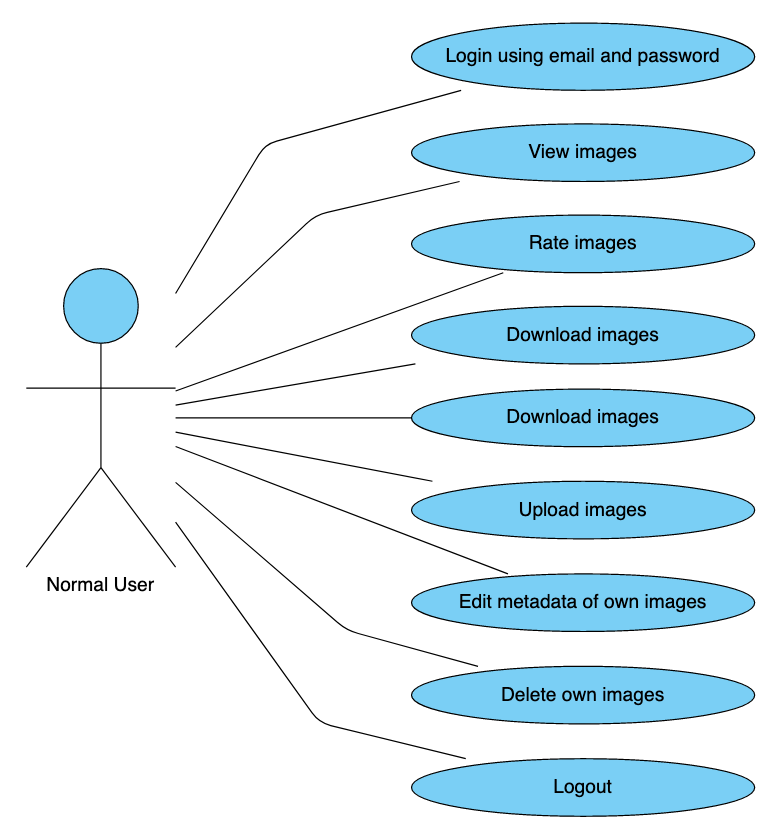
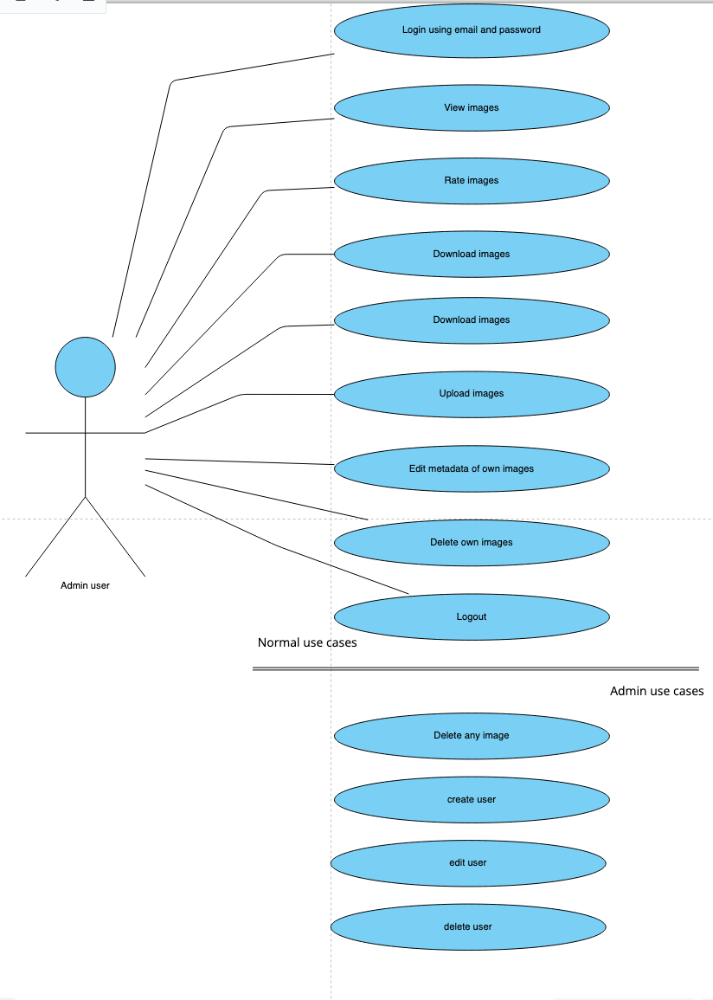
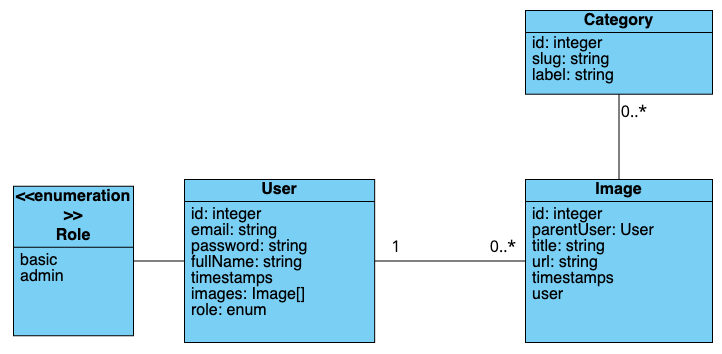

# DIM Dev Decisions

This file will record all the decisions, including the background thinking process, that will be undertaken during this project.
The core of this project will be to learn the Laravel framework by building a web application that handles images.

## Technology

The result of this project will be a web application based on Laravel.
The core will use *Laravel 9* with *PHP 8.1*. The database will be based on *MongoDB*. I have considered using a standard relational db, but,
since I am already familiar with them, I would like to expand my knowledge in the non-relational world.
While the server side services will be all written in php, the frontend will be split between
*Blade* views and JSX component rendered using *Inertia.js*.
I will try to use as many existing Laravel packages as possible, instead of rewriting existing libraries.

## Model

The model is going to change and grow as the project continues. 
However, we can already define a basic idea.
Initially, the application will only have:
- Users
- Images

Users will:
- login, using email and password;
- view any image uploaded into the DIM;
- rate any image uploaded into 
- download any image uploaded into the DIM;
- upload images into the DIM;
- edit the metadata of the images owned by the user. This is preferred to the case where anyone can edit anything as that could end up allowing malicious use of some users;
- delete any owned image;
- logout;

Some users will be admins. Besides the standard user functionalities, they will be also able to:
- delete any image;
- create users;
- edit users;
- delete users.

I am not sure a registration process will be needed. If we consider a space where everyone can see/edit anything uploaded by other users, the access to such space 
should be carefully delegated to very few entities. Thus, I believe that the best approach is to delegate this to admins who will be able to create user accounts.
A User will have:
- id: integer, pk, auto-incremental
- email: string, unique
- password: string
- full name: string
- owned images: Image[]
- timestamps
- role: enum(basic|admin)

Images will have:
- id: integer, pk, auto_incremental
- parentUser: User
- title: string
- categories: Category[]
- url to the file: string. Initially this will be a local server folder. Later on this could become a CDN or a remote server
- timestamps

Category will have:
- id: integer, pk, auto-incremental
- slug: string, unique
- label: string

## Use Cases

This is the usecase diagram representing the described model for a basic user:

This is the usecase diagram representing the described model for an admin user:

## UML

This is the UML representing the described model:

